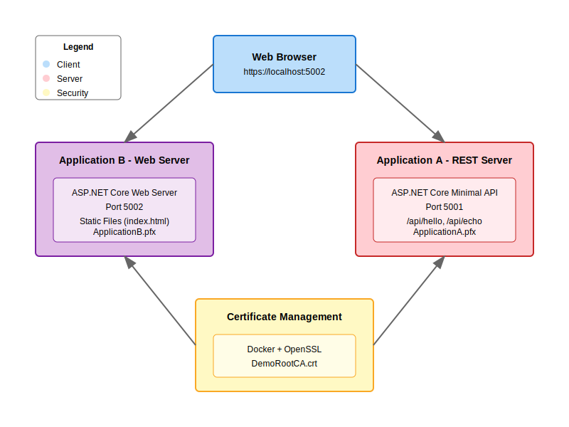

# Demo REST and Browser Applications

This demo project consists of two applications:
1. Application A (REST Server) - A .NET 9 Minimal API serving REST endpoints and JavaScript client
2. Application B (Web Server) - A .NET 9 web application that consumes Application A's API

## Architecture

The following diagram illustrates the distributed architecture of the demo project:



## Prerequisites

- Windows 10 or later
- .NET 9 SDK
- Docker Desktop (only to generate the SSL certificates)
- Visual Studio 2022 or VS Code
- cURL (optional, for API testing)

## Project Structure

```
local-rest-browser-demo/
+-- certificates/           # SSL certificates (generated)
+-- ApplicationA-REST/     # REST Server application
+-- ApplicationB-Web/      # Web application
+-- generate-certs.bat     # Certificate generation script
+-- start-application-a.bat # Script to start Application A
+-- start-application-b.bat # Script to start Application B
+-- README.md
+-- architecture-svg.svg    # Architecture diagram
```

## Setup Instructions

1. Clone or download this repository
2. Open a Command Prompt as Administrator
3. Navigate to the project root folder:
   ```batch
   cd path/to/local-rest-browser-demo
   ```
4. Generate SSL certificates (this script requires Docker to be running locally):
   ```batch
   generate-certs.bat
   ```
   Note: You'll need to accept the security prompts to install the root certificate.

## Running the Applications

1. Start Application A (REST Server):
   - Open a new Command Prompt
   - Navigate to the project folder
   - Run:
     ```batch
     start-application-a.bat
     ```
   - The server will start at https://localhost:5001

2. Start Application B (Web Server):
   - Open another Command Prompt
   - Navigate to the project folder
   - Run:
     ```batch
     start-application-b.bat
     ```
   - The web application will start at https://localhost:5002

## Accessing the Applications

### Application A (REST Server)
- REST API Base URL: https://localhost:5001/api
- JavaScript Client URL: https://localhost:5001/api-client.js

Available Endpoints:
- GET /api/hello - Returns a greeting message
- POST /api/echo - Echoes back the sent message

### Application B (Web Application)
- Open your web browser
- Navigate to https://localhost:5002
- You'll see a warning about the certificate - this is expected since we're using a self-signed certificate
- Click "Advanced" and then "Proceed to localhost (unsafe)"
- You should see the demo web interface

## Testing Application A (REST Server) with cURL

Note: The `-k` flag is used to skip SSL certificate verification since we're using self-signed certificates.

1. Test the Hello endpoint:
```bash
curl -k https://localhost:5001/api/hello
```
Expected response:
```json
{"message":"Hello from Application A!"}
```

2. Test the Echo endpoint:
```bash
curl -k -X POST https://localhost:5001/api/echo \
  -H "Content-Type: application/json" \
  -d "{\"message\":\"Test message\"}"
```
Expected response:
```json
{"echo":{"message":"Test message"}}
```

3. Test CORS headers:
```bash
curl -k -X OPTIONS https://localhost:5001/api/hello \
  -H "Origin: https://localhost:5002" \
  -H "Access-Control-Request-Method: GET" \
  -v
```
Look for the CORS headers in the response:
```
Access-Control-Allow-Origin: https://localhost:5002
Access-Control-Allow-Methods: GET, POST
Access-Control-Allow-Headers: *
```

## Troubleshooting

1. Certificate Issues:
   - Make sure you ran `generate-certs.bat` as Administrator
   - Check that both certificates exist in the `certificates` folder
   - Verify the root certificate is installed in Windows certificate store

2. Port Conflicts:
   - If ports 5001 or 5002 are in use, you'll need to modify the ports in:
     - ApplicationA-REST/src/ApplicationA/Program.cs
     - ApplicationB-Web/src/ApplicationB/Program.cs
     - ApplicationB-Web/src/ApplicationB/wwwroot/index.html

3. CORS Issues:
   - If you see CORS errors in the browser console, verify:
     - Application A's CORS policy allows https://localhost:5002
     - You're accessing Application B from the correct URL

4. Common Errors:
   - "System.IO.FileNotFoundException: Certificate file not found"
     - Run generate-certs.bat again
   - "System.Net.Http.HttpRequestException: The SSL connection could not be established"
     - Check if the root certificate is properly installed

## Development

### Visual Studio 2022
1. Open each .sln file separately
2. Each project can be run directly from Visual Studio
3. Use IIS Express or Kestrel profile as needed

### VS Code
1. Open each project folder separately
2. Install the C# Dev Kit extension
3. Use the built-in debugger to run the applications

## Security Notes

- The SSL certificates are self-signed and for development only
- Do not use these certificates in production
- The demo uses basic CORS settings for simplicity